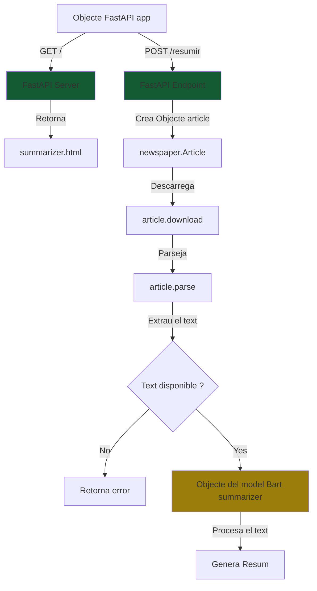

# ResuNews

Aplicació per a resumir noticies en base a una url amb el model bart-large-cnn de Meta

## Com s'utilitza
1. pip install -r requirements.txt
2. python.exe .\main.py
3. uvicorn main:app --reload

## Aspectes de programació
### Llibreries utilitzades:
- fastapi
- uvicorn
- transformers
- newspaper3k
- torch

### Parametres:
- max_lenght
- min_lenght
- temperature
- top_p
- top_k

### FlowChart:

### Usar un model en local o una API:
En aquest cas estem treballant desde un model en local ja que l'us d'una API pot suposar un cost adicional ja que estaras utilitzant els recursos de una altra maquina per a processar les dades. L'us d'una API es necessari al utilitzar grans models que no poden correr a qualsevol maquina (model de raonament, de generacio d'imatges etc) pero per a aquest petit projecte de resumidor de noticies no es necessari ja que no consumeix gaire recursos i dona un bon rendiment.

### Recuros utilitzats:
El model facebook/bart-large-cnn pesa uns 2GB de memoria en disc i te 406M de parametres. Al executarlo per a resumir una noticia utilitza uns 2GB de RAM i utilitza la CPU en lloc de la GPU.

## Proves realitzades:
