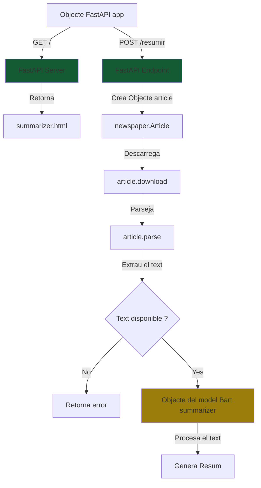
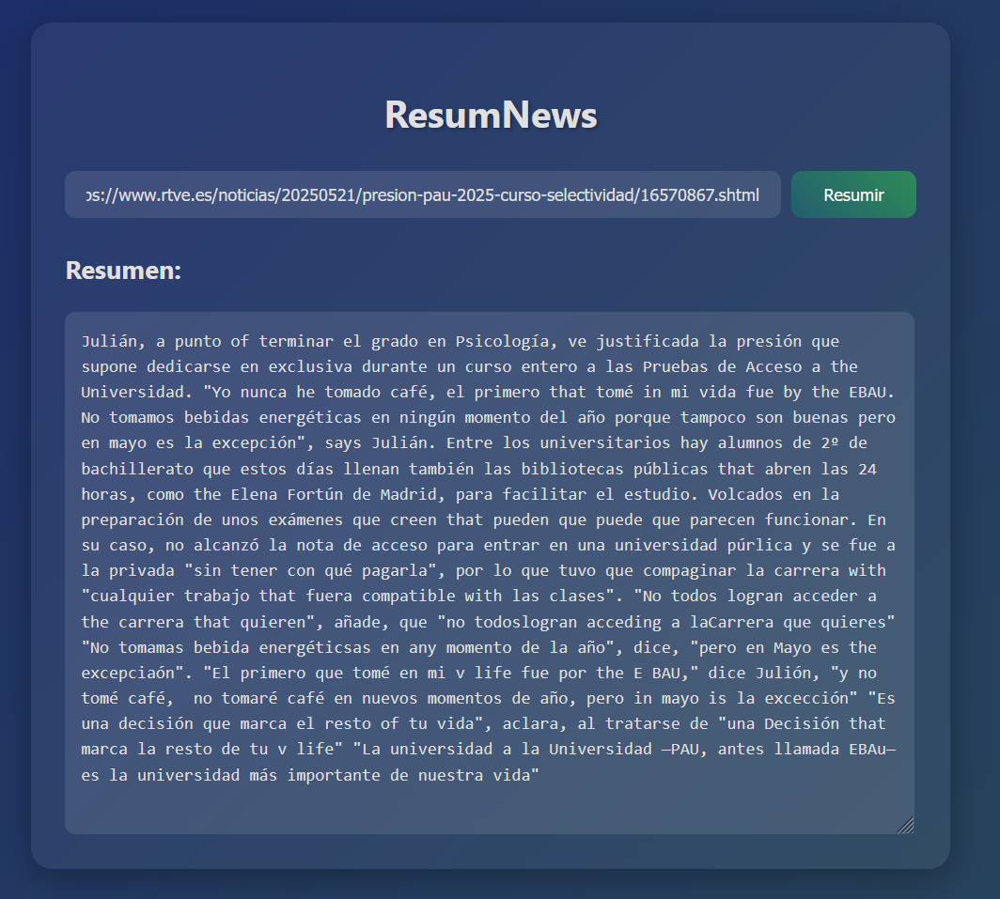
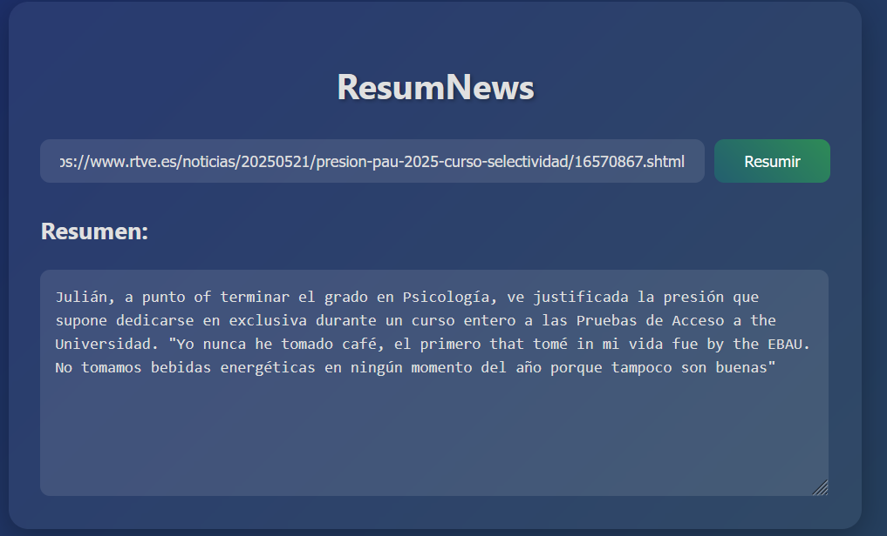
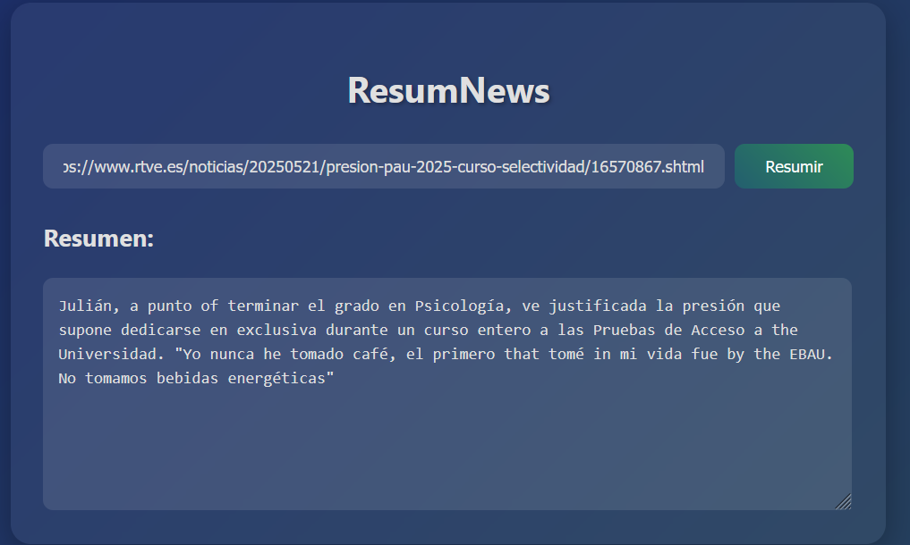

# ResuNews

Aplicació per a resumir noticies en base a una url amb el model bart-large-cnn de Meta

## Índex
1. [Com s'utilitza](#com-sutilitza)
2. [Aspectes de programació](#aspectes-de-programació)
   - [Llibreries utilitzades](#llibreries-utilitzades)
   - [Paràmetres del model](#paràmetres-del-model)
   - [FlowChart](#flowchart)
   - [Usar un model en local o una API](#usar-un-model-en-local-o-una-api)
   - [Recursos utilitzats](#recursos-utilitzats)
3. [Proves realitzades](#proves-realitzades)
   - [Max i Min Lenght](#max-i-min-lenght)
4. [Refinar el model](#refinar-el-model)
5. [Limitacions del model](#limitacions-del-model)
6. [Aplicacions practiques](#aplicacions-practiques)
7. [Conclusion](#conclusion)
8. [Definicions](#definicions)
   - [IA generativa](#ia-generativa)
   - [Model](#model)
   - [Dataset](#dataset)
   - [Entrenar una IA](#entrenar-una-ia)
   - [Fer inferència d'una IA](#fer-inferència-duna-ia)
   - [RAG](#rag-retrieval-augmented-generation)
   - [Fine-tuning](#fine-tuning)
9. [Webgrafia](#webgrafia)
10. [Us de la IA en el projecte](#us-de-la-ia-en-el-projecte)

## Com s'utilitza
1. pip install -r requirements.txt
2. python.exe .\main.py
3. uvicorn main:app --reload

## Aspectes de programació
### Llibreries utilitzades:
- **FastAPI**: Framework de Python per a crear APIs web d'alta velocitat. L'utilitzem per crear el servidor web i gestionar les peticions HTTP.
- **Uvicorn**: Servidor ASGI d'alt rendiment que permet executar aplicacions FastAPI. És necessari per executar la nostra aplicació web.
- **Transformers**: Llibreria de Hugging Face que proporciona accés a models pre-entrenats. En aquest cas, l'utilitzem per carregar i utilitzar el model BART per a la generació de resums.
- **Newspaper3k**: Llibreria especialitzada en l'extracció de contingut d'articles de notícies. Ens permet obtenir el text net d'una URL de notícia.
- **Torch**: Framework de deep learning necessari per executar els models de Transformers. És requereix per al model BART.

### Paràmetres del model:
- **max_length**: Longitud màxima (en tokens) del resum generat. En el nostre cas està configurat a 500 per obtenir resums detallats però concisos.
- **min_length**: Longitud mínima del resum. Establert a 100 per assegurar que el resum tingui prou contingut.

Els seguents parametres no son recomanables en aquest cas ja que:

1. Les noticies requereixen resumens precisos, no creatius
2. Busco tenir consistencia en los resumens
3. El model esta entrenat per a usar noticies de forma objectiva

- **temperature**: Controla la creativitat/aleatorietat en la generació del text.
- **top_p**: Paràmetre de nucleus sampling que controla la diversitat del text generat, practicament com la temperatura.   
- **top_k**: Fa referència als tokens de resposta més probables, per exemple un top_k:50 fara que el model utilitze sols els 50 tokens més probables.

### FlowChart:

### Usar un model en local o una API:
En aquest cas estem treballant desde un model en local ja que l'us d'una API pot suposar un cost adicional ja que estaras utilitzant els recursos de una altra maquina per a processar les dades. L'us d'una API es necessari al utilitzar grans models que no poden correr a qualsevol maquina (model de raonament, de generacio d'imatges etc) pero per a aquest petit projecte de resumidor de noticies no es necessari ja que no consumeix gaire recursos i dona un bon rendiment.

### Recuros utilitzats:
El model facebook/bart-large-cnn pesa uns 2GB de memoria en disc i te 406M de parametres. Al executarlo per a resumir una noticia utilitza uns 2GB de RAM i utilitza la CPU en lloc de la GPU.

## Proves realitzades:
Com he dit anteriorment els parametres de temperatura, top k i top p no son utilitzats en aquest model ja que no volem que tingue creativitat o variabilitat en el text, ja que necessitem resums objectius i reals. Per tant sols he fet proves amb el maxim i minim de tokens

### Max i Min Lenght:
- Parametre alt (1000,500)

- Parametre mita (500,100)

- Parametre petit(100, 56)

## Refinar el model
Aquest model no utilitza cap tipus de prompt per a funcionar, per tant no podem refinarlo per a donarnos respostes mes concises i reals.

## Limitacions del model
1. **Longitud del text d'entrada**: El model sols pot processar els primers 1024 tokens del text d'entrada, per tant si la notícia és molt llarga, es perdran parts del contingut.

2. **Recursos computacionals**: Com s'ha mencionat anteriorment, el model requereix uns 2GB de RAM i utilitza la CPU, el que pot fer que el procés sigui més lent en màquines amb recursos limitats.

3. **Dependència de la qualitat del text**: El model depèn de la capacitat de la llibreria Newspaper3k per extreure correctament el text de la notícia. Si la pàgina web té una estructura inusual o el contingut no està ben formatat, pot fallar l'extracció.

4. **Idioma**: El model BART-large-CNN està entrenat principalment amb textos en anglès, per tant pot no funcionar òptimament amb textos en altres idiomes.

5. **No refinable**: Com s'ha mencionat anteriorment, al no utilitzar prompts, no es pot refinar o ajustar el comportament del model per a casos específics.

## Aplicacions practiques
Clarament la aplicació que te aquest projecte es el de resumir noticies per a gent que no te temps per a llegir ho tot, es podria implementar amb un lector en veu que llegeixque lo noticiare resumit per exemple cada mati al despertarse l'usuari.

## Conclusion
En aquest projecte he apres a utilitzar diferents models de IA en local amb els seus parametres i ha programar aplicacions en base a aquestos models. Vaig començar utilizant un model de GPT per a fer un expert en formatges, pero vaig voler buscar una aplicació que tinguesa una aplicació practica mes util. Al final he acabat tenint aquest resumidor de noticies que pot tenir aplicacions realment utils.

## Definicions

### IA generativa
És un tipus d'intel·ligència artificial capaç de crear contingut nou (text, imatges, música, etc) a partir del que ha aprés durant el seu entrenament.

### Model
És un programa d'ordinador entrenat amb dades per a realitzar una tasca específica.

### Dataset
És un conjunt de dades estructurades que s'utilitza per entrenar models d'IA. Per exemple, per entrenar un model de reconeixement d'imatges, el dataset podria contenir milers d'imatges etiquetades.

### Entrenar una IA
És el procés d'alimentar un model amb dades (dataset) perquè aprengui patrons i relacions. Durant l'entrenament, el model ajusta els seus paràmetres interns per millorar la seva precisió en la tasca assignada.

### Fer inferència d'una IA
És el procés d'utilitzar un model ja entrenat per obtenir resultats amb noves dades. Per exemple, quan el nostre model BART rep una notícia nova i genera un resum, està fent inferència.

### RAG (Retrieval-Augmented Generation)
És una tècnica que combina la generació de text amb la recuperació d'informació de fonts externes. Permet que els models d'IA accedeixin a informació actualitzada i específica mentre generen respostes.

### Fine-tuning
És el procés de reentrenar un model pre-entrenat amb dades específiques per adaptar-lo a una tasca concreta. Això permet aprofitar models generals i especialitzar-los per aplicacions específiques.

## Webgrafia
1. **Hugging Face - BART-large-CNN**: Documentació oficial del model utilitzat
   - https://huggingface.co/facebook/bart-large-cnn

2. **FastAPI Documentation**: Documentació oficial per a la implementació del servidor web
   - https://fastapi.tiangolo.com/

3. **Newspaper3k Documentation**: Documentació de la llibreria per a l'extracció de text de notícies
   - https://newspaper.readthedocs.io/en/latest/

4. **PyTorch Documentation**: Documentació del framework de deep learning
   - https://pytorch.org/docs/stable/index.html

5. **Transformers Documentation**: Documentació de la llibreria Transformers de Hugging Face
   - https://huggingface.co/docs/transformers/index

## Us de la IA en el projecte
He utilitzat copilot per a crear les funcions per a conectarse al model, tambe per a ajudarme a la flowchart i per a certs aspectes concrets de la documentació.
