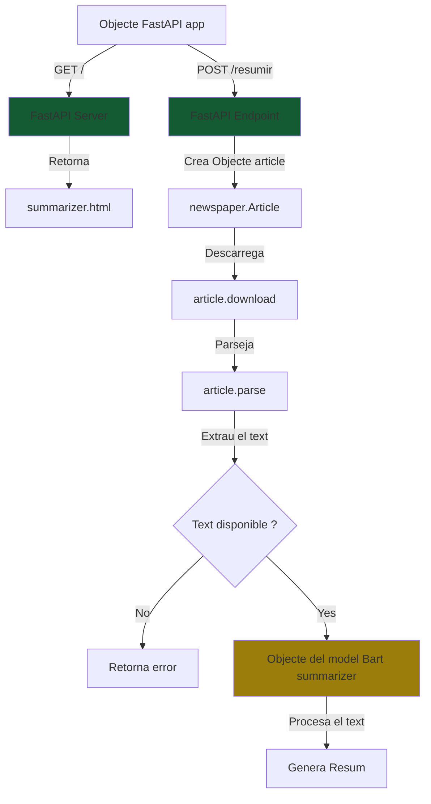

# ResuNews

Aplicació per a resumir noticies en base a una url amb el model bart-large-cnn de Meta

## Com s'utilitza
1. pip install -r requirements.txt
2. python.exe .\main.py
3. uvicorn main:app --reload

## Aspectes de programació
### Llibreries utilitzades:
- **FastAPI**: Framework de Python per a crear APIs web d'alta velocitat. L'utilitzem per crear el servidor web i gestionar les peticions HTTP.
- **Uvicorn**: Servidor ASGI d'alt rendiment que permet executar aplicacions FastAPI. És necessari per executar la nostra aplicació web.
- **Transformers**: Llibreria de Hugging Face que proporciona accés a models pre-entrenats. En aquest cas, l'utilitzem per carregar i utilitzar el model BART per a la generació de resums.
- **Newspaper3k**: Llibreria especialitzada en l'extracció de contingut d'articles de notícies. Ens permet obtenir el text net d'una URL de notícia.
- **Torch**: Framework de deep learning necessari per executar els models de Transformers. És requereix per al model BART.

### Paràmetres del model:
- **max_length**: Longitud màxima (en tokens) del resum generat. En el nostre cas està configurat a 500 per obtenir resums detallats però concisos.
- **min_length**: Longitud mínima del resum. Establert a 100 per assegurar que el resum tingui prou contingut.

Els seguents parametres no son recomanables en aquest cas ja que:

1. Les noticies requereixen resumens precisos, no creatius
2. Busco tenir consistencia en los resumens
3. El model esta entrenat per a usar noticies de forma objectiva

- **temperature**: Controla la creativitat/aleatorietat en la generació del text.
- **top_p**: Paràmetre de nucleus sampling que controla la diversitat del text generat, practicament com la temperatura.   
- **top_k**: Fa referència als tokens de resposta més probables, per exemple un top_k:50 fara que el model utilitze sols els 50 tokens més probables.

### FlowChart:

### Usar un model en local o una API:
En aquest cas estem treballant desde un model en local ja que l'us d'una API pot suposar un cost adicional ja que estaras utilitzant els recursos de una altra maquina per a processar les dades. L'us d'una API es necessari al utilitzar grans models que no poden correr a qualsevol maquina (model de raonament, de generacio d'imatges etc) pero per a aquest petit projecte de resumidor de noticies no es necessari ja que no consumeix gaire recursos i dona un bon rendiment.

### Recuros utilitzats:
El model facebook/bart-large-cnn pesa uns 2GB de memoria en disc i te 406M de parametres. Al executarlo per a resumir una noticia utilitza uns 2GB de RAM i utilitza la CPU en lloc de la GPU.

## Proves realitzades:
Com he dit anteriorment els parametres de temperatura, top k i top p no son utilitzats en aquest model ja que no volem que tingue creativitat o variabilitat en el text, ja que necessitem resums objectius i reals. Per tant sols he fet proves amb el maxim i minim de tokens

### Max i Min Lenght:
- Parametre alt (1000,500)

- Parametre mita (500,100)

- Parametre petit(100, 56)

